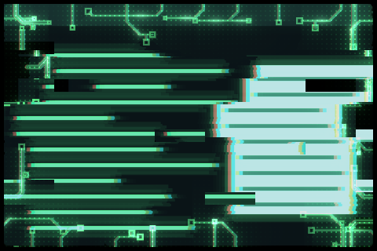

# kzzzt Open

Opening strikes the window into being with one overexposed, torn frame, then it stutters in through displaced bands and phosphor bloom while circuit traces flare at its edges and settle.



Frame rendered by Umbriel running this shader over a synthetic window sample, in the shader's own colours at 55% of the opening; it is not a screenshot of a desktop session.

## Use

Save [effect.toml](effect.toml) and [shader.glsl](shader.glsl) together in `~/.config/umbriel/shaders/community/animation/kzzzt-open/`, keeping the [MIT license](../../LICENSES/weegs710-MIT.txt). Merge [config.toml](config.toml) into your Umbriel configuration:

```toml
[include]
files = ["shaders/community/animation/kzzzt-open/effect.toml"]

[animation]
enabled = true

[animation.windows_in]
enabled = true
effect = "kzzzt-open"
duration_ms = 900
curve = "linear"
```

Append the include path to an existing `files` array and merge existing tables; do not duplicate them. Including the preset registers it; the selector activates the opening. Animation selection is global per event.

[kzzzt Close](../kzzzt-close/) is the matching closing.

## Theme palette

This preset enables `palette = true` in `effect.toml`. Artwork colours follow
Umbriel's `[colors]` accents, warning, and error colours, while retaining shading
and highlights. Set `palette = false` in that preset to restore the original
colours (green traces with cyan and red colour splits). Shader colour constants are the fallback colours.

## Configuration options

Edit the existing `[effects.preset.kzzzt-open]` table in [effect.toml](effect.toml).
The [complete configuration reference](../../README.md#configuration-reference) explains
selection, overrides, and accepted ranges. The values below are this preset's shipped
settings, including defaults for omitted keys.

| TOML setting | Shipped value | What changing it does |
| --- | --- | --- |
| `kind` | `"animation"` | Keep this kind: the source implements its `animation` entry point. |
| `shader` | `"shader.glsl"` | Loads the source beside this preset; change the path only when using another compatible source. |
| `palette` | `true` | Use theme colours for artwork. Set false to restore the original shader colours. |

Edit the event table in your main Umbriel configuration (the activation
example is [config.toml](config.toml)). Larger `duration_ms` gives a slower
transition. Both `[animation] enabled` and the event must be enabled.

| Event | Example duration | Example curve |
| --- | --- | --- |
| `[animation.windows_in]` | `900` ms | `"linear"` |

Use `effect = ""` to clear the custom selection or event `enabled = false`
to disable the transition. Spring curves choose their own duration.
This shader uses linear progress: changing easing does not reshape its internal phases.
Opening `style` and `scale` do not tune a working custom shader.
There is no animation-preset TOML `speed`; use event timing.

### Shader controls

Edit these values in [shader.glsl](shader.glsl), not in TOML. `#define` is
active GLSL code; comments use `//` or `/* ... */`. Start with small changes
and keep paired shaders in sync. Keep size and duration divisors positive.
The shipped values are what the author uses; other values were not range-tested.

| GLSL control or expression | Shipped value | Visual effect |
| --- | --- | --- |
| `DURATION` | `0.9` | Seconds; set it to `duration_ms` divided by 1000. Keep it above about 0.4: below that a smoothstep's edges reverse and its result is undefined. |
| `STRIKE_FR` | `3.0` | Frame, at 30 frames per second, on which the overexposed strike lands. Before it the window is not drawn. |
| `PEAK` | `0.36` | Progress at which the surge crests and starts to drain. |
| `TEAR_PX` | `60.0` | Base sideways shift, in logical pixels, of a torn band. It scales with the tension and is larger on the strike frame. |
| `SPLIT_PX` | `9.0` | Base colour split in logical pixels. It scales up with the tension. |
| `STAGGER` | `0.08` | Seconds over which the edge traces catch after the strike. |
| `DECAY_RATE` | `4.5` | How fast the traces die away; higher is quicker. |
| `SURGE_GAIN` | `1.5` | Brightness of the edge traces. |

Save and reload; see [reloading edits](../../README.md#reloading-edits).

## Compatibility and cost

Targets `animation.windows_in` with the Umbriel preset effects API and GLSL ES 1.00. The window is not drawn before the strike frame, and at the end of the opening it is the unmodified window: on a headless Umbriel the last frame before completion (99.4% progress) differed from the plain window by no pixel more than 3%. No previous-frame feedback or extra textures are used.

28 texture samples per fragment, plus bounded loops along the window edges. This transition distorts captured window content and adds bloom over it. No hardware performance benchmark is claimed.

The shader steps in hard 30 frames per second jumps and flickers on purpose. It uses the transition's random seed, so every opening looks different.

See [validation and limitations](../../VALIDATION.md) for the collection's tested revisions and remaining runtime limitations.

## Attribution

Author/contributor: weegs710. License: [MIT](../../LICENSES/weegs710-MIT.txt).

The point-to-segment distance helper (`ko_segment`) is from Barrulus's [Sentient Circuit v2](../../window/sentient-circuit-v2/), MIT, see [LICENSES/Barrulus-MIT.txt](../../LICENSES/Barrulus-MIT.txt).
