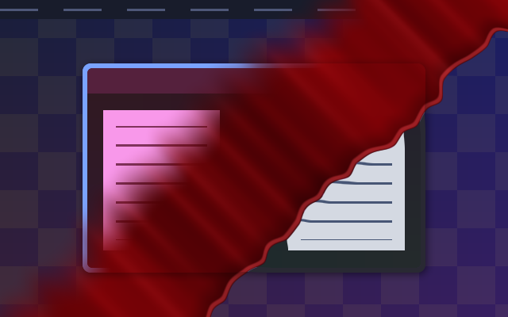

# Vampire Blood Wash

A Vampire-family workspace reveal: a thick wine-red wash rolls over the entire
scene with rounded rivulets, crimson streaks and a glossy wet edge. The incoming
workspace appears as the blood drains behind the advancing front. The scene
switch happens under the opaque leading edge, so the departing workspace cannot
show through again as the blood fades.

- **Downwards:** top-left to bottom-right.
- **Upwards:** bottom-left to top-right.

Both directions travel left to right. Horizontal navigation uses the downwards
pattern for forwards/right and the upwards pattern for backwards/left.



[Downwards animation](preview.gif) · [Upwards animation](preview-up.gif)

Previews are compositor captures from a private headless session with synthetic
wallpaper, a panel and two populated workspaces, sampled every 40 ms.

## Use

Save [effect.toml](effect.toml) and [shader.glsl](shader.glsl) together under
`~/.config/umbriel/shaders/community/animation/vampire-blood-wash/`.
Merge [config.toml](config.toml) into your configuration:

```toml
[include]
files = ["shaders/community/animation/vampire-blood-wash/effect.toml"]

[animation]
enabled = true

[animation.workspaces]
enabled = true
style = "reveal"
effect = "vampire-blood-wash"
duration_ms = 1400
curve = "linear"
```

Append to existing include lists and merge existing tables. Including the preset
registers it; selecting the effect enables it. See [installation](../../README.md#install).

## Tuning

Increase `duration_ms` for a slower wash. In [shader.glsl](shader.glsl),
`WASH_WIDTH` controls the blood band's width, `RIVULET_LENGTH` its uneven leading
edge, and `REFRACTION` the wet rim's displacement in logical pixels. The three
colour constants control the deep wine base, crimson body and glossy highlight.
These are GLSL controls, not TOML parameters. No theme palette or audio is used.

The held random seed keeps the front stable throughout each transition.
Reversing a swipe retraces the effect; exact endpoints return the original scenes.

## Compatibility and cost

Requires Umbriel's **full-scene workspace reveal API**, tested with
`0.1.0 (2145668)`. Outgoing and incoming scene samples cover wallpaper, windows,
decorations and shell surfaces together. The blood remains visible over shared
wallpaper even when it is identical on both workspaces. Cursor rendering and
output postprocessing follow the transition.

Older root-mask reveal builds and the experimental `scene-v1` interface are
incompatible. This standalone shader uses two scene samples and four procedural
noise evaluations per intermediate pixel, with no feedback or external textures.
It preserves premultiplied alpha. Full-scene captures have additional costs;
hardware performance, HDR and rotated outputs have not been benchmarked.
See [validation](../../VALIDATION.md#vampire-blood-wash-2026-10-10).

## Attribution

Original shader by Barrulus with Codex assistance.
[MIT license](../../LICENSES/Barrulus-MIT.txt).
