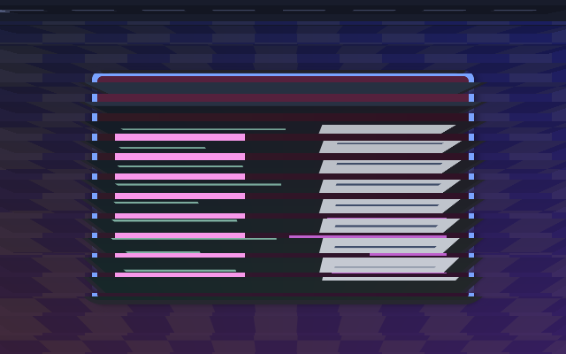

# Workspace Venetian Blinds

Horizontal slats turn in perspective and cascade to edge-on, revealing the destination between them.



[Animated full-scene preview](preview.gif), sampled from a private headless
Umbriel session with synthetic wallpaper, a panel and two populated workspaces.
The animation uses the configured 1000 ms timeline. These are compositor
captures, not a recording of a personal desktop or a performance benchmark.

## Use

Save [effect.toml](effect.toml) and [shader.glsl](shader.glsl) together under
`~/.config/umbriel/shaders/community/animation/workspace-venetian-blinds/`, retaining the
license notices below. Merge [config.toml](config.toml) into your configuration:

```toml
[include]
files = ["shaders/community/animation/workspace-venetian-blinds/effect.toml"]

[animation]
enabled = true

[animation.workspaces]
enabled = true
style = "reveal"
effect = "workspace-venetian-blinds"
duration_ms = 1000
curve = "linear"
```

Append to existing include lists and merge existing tables. Including a preset
registers it; the event selector enables it. `style = "reveal"` is required.
See [installation](../../README.md#install).

## Configuration options

The example uses **1000 ms** and `curve = "linear"`. Increase the duration
for a slower transition. Eased progress drives the shader; reversing a swipe
retraces the same effect with the transition’s held seed. Spring curves choose
their own duration. Clear `effect = ""` and restore `style = "slide"` to return
to native workspace sliding.

Edit [shader.glsl](shader.glsl) to tune the artwork: `rows = 18.0` sets the slat count. The `0.20` cascade and `0.74` turn interval control sequencing.
These are GLSL controls, not TOML parameters. Colours are fixed; this preset
does not use the theme palette or audio input.

## Compatibility and cost

Requires Umbriel’s **full-scene workspace reveal API**, tested with
`0.1.0 (2145668)`: `umbriel_sample` reads the outgoing scene and
`umbriel_sample_incoming` reads the incoming scene. Both cover the whole output,
including wallpaper, windows, decorations and shell surfaces. The cursor and
output postprocessing follow the transition. Identical shared content can look
unchanged where a transition simply exchanges matching pixels.

Older root-mask reveal builds and the experimental `scene-v1` interface are
incompatible with this packaged preset. It uses the standard `animation` entry
point and requires no shared shader file or external texture. Exact endpoints
return the original outgoing and incoming scene respectively.

Three candidate slats per pixel. No previous-frame feedback. Full-scene composition has capture costs;
hardware performance, HDR and rotated-output composition have not been
benchmarked. See [validation](../../VALIDATION.md#recovered-workspace-reveals-2026-10-10).

## Provenance and attribution

Recovered from the effects-session reveal bundle. Ported to the current reveal API with
output-wide coordinates and navigation direction from `umbriel_workspace_axis`.
Shared helpers and the saved parameter values are embedded in this shader so it
can be downloaded independently.

Original shader by Barrulus with Codex assistance.
[MIT license](../../LICENSES/Barrulus-MIT.txt).
