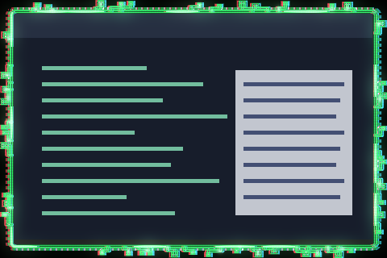

# kzzzt Ring

A glitching circuit-trace ring around the focused window, with travelling arcs, dashes, and hollow tendrils, colour-split glitches, scanlines, and a slow roll. It reacts to sound when something feeds Umbriel an audio level and has a steady idle look when nothing does.



Frame rendered by Umbriel running this shader over a synthetic window sample, in the shader's own colours with no audio feed, so it shows the idle look; it is not a screenshot of a desktop session. It was rendered with `[appearance] border_width = 12`; a thinner border draws the same ring closer to the window.

## Use

Download [effect.toml](effect.toml) and [shader.glsl](shader.glsl) using GitHub’s **Download raw file** button and save them together in `~/.config/umbriel/shaders/community/border/kzzzt-ring/`. Keep the license notice linked below with your files. See [installation](../../README.md#install) for details.

Then merge this into `~/.config/umbriel/config.toml`:

```toml
[include]
files = ["shaders/community/border/kzzzt-ring/effect.toml"]

[effects]
border = "kzzzt-ring"
```

Append the include path to your existing `files` array and merge selectors into existing tables. Including `effect.toml` defines the preset; the selector enables it. [`config.toml`](config.toml) contains the same copyable example.

Borders apply to the focused, decorated window. Fullscreen and urgent windows do not display the border effect.

[kzzzt](../../window/kzzzt/) is the matching window effect. Install both and select both (`window = "kzzzt"` and `border = "kzzzt-ring"`) and they glitch on the same beat. If you edit the glitch values (`STEP`, `SPLIT_PX`, the `TEAR_*` and `FLINCH_*` constants) in one, make the same edit in the other.

## Audio

Audio is optional. Umbriel can hand effects one level from 0 to 1 that a program of your choice sends it; see [Audio input](https://github.com/noctalia-dev/umbriel/blob/main/docs/user/ipc.md#audio-input) for how a program does that. This collection does not include such a program.

- With nothing feeding Umbriel, or a program that is running while nothing plays, kzzzt Ring shows its idle look: a steady ring with its tendrils. Silence below a level of about 0.02 counts as nothing playing.
- With a program feeding it sound, the current and tendrils follow the level, bass pulses the current, and treble widens the colour split.

## Theme palette

This preset enables `palette = true` in `effect.toml`. Artwork colours follow
Umbriel's `[colors]` accents, warning, and error colours, while retaining shading
and highlights. Set `palette = false` in that preset to restore the original
colours (green traces with cyan and red colour splits). Shader colour constants are the fallback colours.

## Configuration options

Edit the existing `[effects.preset.kzzzt-ring]` table in [effect.toml](effect.toml).
The [complete configuration reference](../../README.md#configuration-reference) explains
selection, overrides, and accepted ranges. The values below are this preset's shipped
settings, including defaults for omitted keys.

| TOML setting | Shipped value | What changing it does |
| --- | --- | --- |
| `kind` | `"border"` | Keep this kind: the source implements its `border` entry point. |
| `shader` | `"shader.glsl"` | Loads the source beside this preset; change the path only when using another compatible source. |
| `palette` | `true` | Supplies theme colours. Disable it to use the shader's fallback colours. |
| `padding` | `8` | Logical pixels of extra outward drawing space. Reducing it can clip artwork; it is not a painted-width control. |
| `speed` | `1.0` | Time multiplier: 0.5 halves speed, 2 doubles it, 0 freezes at time zero. Keep it at 1.0 so the ring's clock matches kzzzt's. |
| `animated` | `true` | Set false to freeze this border at time zero. |
| `overlay` | `""` | No inward pass is attached. A compatible window preset can be attached by name. |

The optional `[effects.preset.kzzzt-ring.light]` subtable is enabled in this preset.
Adding it enables light; removing the whole table disables it. Shader-painted glow is separate.

| Light setting | Shipped value | What changing it does |
| --- | --- | --- |
| `spread` | `24` | Logical-pixel reach; larger spreads light farther. |
| `intensity` | `0.8` | Brightness; lower is dimmer, 0 makes the light invisible. |
| `threshold` | `0.5` | Raise to emit only from brighter ring pixels; lower to include dimmer pixels. |

### Shader controls

Edit these values in [shader.glsl](shader.glsl), not in TOML. `#define` is
active GLSL code; comments use `//` or `/* ... */`. Start with small changes
and keep paired shaders in sync. Keep size and duration divisors positive.
The shipped values are what the author uses; other values were not range-tested.

| GLSL control or expression | Shipped value | Visual effect |
| --- | --- | --- |
| `LINE_INNER`, `LINE_OUTER` | `1.5`, `4.0` | Distance, in logical pixels outside the window edge, of the two steady lines of the ring. |
| `ARC_SPEED`, `DASH_SPEED` | `40.0`, `6.0` | How fast the arcs travel (logical pixels per second) and how fast the dashes crawl. |
| `TENDRIL_CHANCE`, `IDLE_TENDRIL_CHANCE` | `0.9`, `0.55` | Share of slots along the border that hold a tendril, with and without an audio feed. Lower gives fewer tendrils. |
| `TENDRIL_REACH` | `15.0` | How far the hollow tendrils reach outward from the border, in logical pixels. |
| `SILENCE_LOW`, `SILENCE_HIGH` | `0.02`, `0.10` | Audio levels below the first count as silence and show the idle look; from the second up the effect is fully reactive, with a smooth blend between. |
| `FLINCH_PERIOD`, `FLINCH_CHANCE` | `15.0`, `0.8` | Seconds between chances for the ring to flinch, and the odds that a chance flinches. |
| `TEAR_PX` | `6.0` | Base sideways shift, in logical pixels, of a torn band during a flinch. With an audio feed it is multiplied by 0.5 plus 3 times the level. |
| `SCANLINE_DEPTH` | `0.18` | How much alternate pixel rows darken. `0` removes the scanlines. |
| `GRILLE_DEPTH` | `0.12` | Strength of the red, green, blue column mask. `0` removes it. |
| `ROLL_STRENGTH`, `ROLL_PERIOD` | `0.06`, `7.0` | Brightness of the slow band that sweeps down the ring, and seconds per sweep. `ROLL_STRENGTH = 0` removes it. |
| `FLICKER` | `0.03` | Brightness flicker of the whole ring. `0` removes it. |

Save and reload; see [reloading edits](../../README.md#reloading-edits).

## Compatibility and cost

Requires an Umbriel build that includes [`105e1bc8`](https://github.com/noctalia-dev/umbriel/commit/105e1bc8), which added the audio level the shader reads; older builds were not tested. See [validation and limitations](../../VALIDATION.md). No previous-frame feedback buffers are used. The shader reads `umbriel_time`, so it keeps requesting frames while a window is focused. It takes no samples of the window and evaluates its ring shape three times per border fragment, with bounded loops. This adds a focused-border pass plus compositor light and blur. No performance benchmark is claimed.

## Attribution

Author/contributor: weegs710. License: [MIT](../../LICENSES/weegs710-MIT.txt).

The point-to-segment distance helper (`sr_segment`) is from Barrulus's [Sentient Circuit v2](../../window/sentient-circuit-v2/), MIT, see [LICENSES/Barrulus-MIT.txt](../../LICENSES/Barrulus-MIT.txt).
