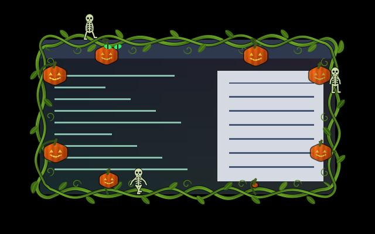

# Something’s Watching — Pumpkin Parade

Twisting green vines braid around the frame, with leaves and curling tendrils.
Jack-o’-lanterns grow on stalks extending into the window. Cat eyes blink between
the leaves, while three tiny skeletons march around the perimeter with swinging
arms and stepping legs. The preset name is `after-dark.somethings-watching`.

[Watch fifteen seconds of pumpkin growth and the skeleton parade](preview.gif).
These are private headless Umbriel captures over synthetic light/dark content.
The animation plays at its configured speed, sampled at 20 fps.

## Use

Save this directory in `~/.config/umbriel/shaders/community/border/somethings-watching/`.
Also save [the companion overlay](../../window/somethings-watching-overlay/) under
`window/somethings-watching-overlay/`, preserving relative paths. Both directories
need `effect.toml` and `shader.glsl`. The border includes its overlay automatically;
do not include or select the overlay separately.

Merge [config.toml](config.toml) into your configuration, appending include paths
and merging existing tables. Including the preset registers it; selecting
`after-dark.somethings-watching` enables it.

## Configuration options

Edit the constants in **both** shader files so their shared artwork stays identical:

| Constant | Default | Meaning |
| --- | --- | --- |
| `INTENSITY` | `0.95` | Overall artwork opacity, 0–1. |
| `PUMPKIN_SIZE` | `22.0` | Maximum fruit half-width in logical pixels; try 16–26. |
| `SKELETON_SCALE` | `1.15` | Character scale; try 0.8–1.15 within the allocated padding. |
| `PARADE_SPEED` | `22.0` | Skeleton travel speed in logical pixels per second; try 12–40. |

Preset `padding = 48` reserves outward drawing space. Artwork can reach up to
70 logical pixels inward; the centre returns unchanged outside this band.
Pumpkins grow on staggered fifteen-second cycles, with fewer fruit anchors on
short sides. Cat eyes use separate eleven-second peek/blink cycles. Border
`speed` scales the entire scene, including its companion overlay.

## Compatibility and cost

Requires Umbriel’s preset-effects API. The border and its overlay follow focus
and decoration visibility together. The same geometry is evaluated on each side
of the client edge to keep vines, stalks and moving characters continuous.
No textures, previous-frame feedback or native light blur passes are required.

Work is bounded: two vine strands, repeated leaf/tendril fields, up to eight
pumpkins with short stalk segments, three skeletons and four eye candidates.
Sprite distance checks skip detailed drawing away from each object. The overlay
reads one source pixel and preserves its alpha.

Tested with Umbriel 0.1.0 (`1d01b3a`), including a full fifteen-second private
compositor capture. Supplemental software-GLES checks cover 192 combinations
of border/overlay, growth phases, wide/tall/tiny windows, scale and source alpha.
They check premultiplication, overlay alpha, the clear centre, and identical
shared geometry. Hardware performance has not been benchmarked.

## Attribution

Original procedural artwork by Barrulus with Codex assistance.
[MIT license](../../LICENSES/Barrulus-MIT.txt).
