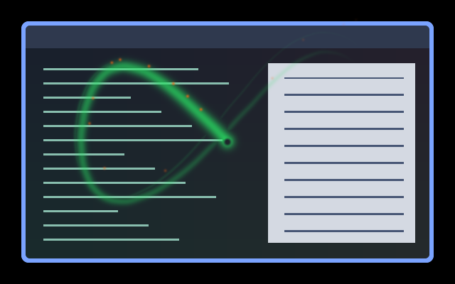
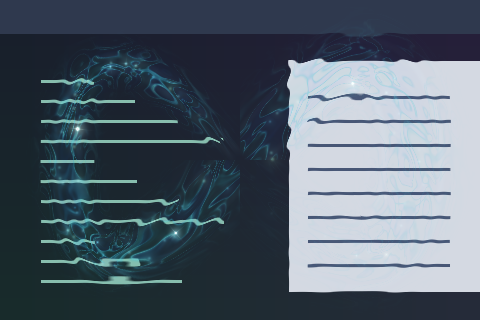
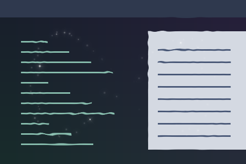
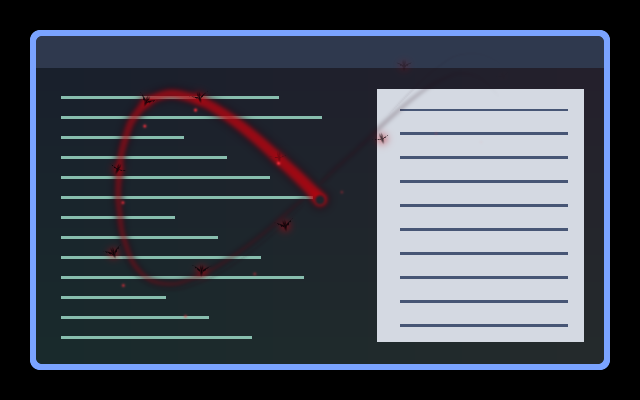

# Cursor effects

[Installation and configuration](../README.md#install)

| Preview | Effect | Description |
| --- | --- | --- |
|  | [comet](comet/) | A curved rainbow comet with a two-second fading tail and smoothly blended crossings. |
|  | [cursor-ring](cursor-ring/) | A thin blue ring around the pointer breathes in radius and brightness. |
|  | [cursor-sparkle](cursor-sparkle/) | Five theme-coloured dots orbit the pointer at a wavering distance. |
|  | [fairy-tail](fairy-tail/) | A long multicolour cloud with drifting grains and tiny twinkling stars. |
|  | [glow](glow/) | A soft theme-accent halo around the pointer. |
|  | [orbiting-hearts](orbiting-hearts/) | Six small hearts share an evenly spaced orbit around the pointer. |
|  | [rainbow-tunnel-bare](rainbow-tunnel-bare/) | The colourful pointer-centred tunnel without the surrounding ring. |
|  | [rainbow-tunnel](rainbow-tunnel/) | A colourful tunnel centred on the pointer, with a surrounding ring. |
|  | [seeing-stars](seeing-stars/) | Cartoon birds and tumbling stars circle the pointer. |
|  | [shockwave](shockwave/) | A pulsing shockwave centred on the pointer. |
|  | [solar-system](solar-system/) | Five planets, rings, and orbiting moons surround a small sun at the pointer. |
|  | [spotlight](spotlight/) | A spotlight centred on the pointer shades the rest of the output. |
|  | [witchfire](witchfire/) | A long curved green fire ribbon, peeling wisps, drifting orange embers and a faint stationary glow. |
|  | [pond-wake](pond-wake/) | A refractive pond wake with curling blue-green wisps and irregular fairy-like flashes. |
|  | [starlight](starlight/) | Subtle untinted refraction with sparse, curling white sparkles. |
|  | [vampire-wake](vampire-wake/) | A curved crimson ribbon with burgundy wisps, falling red sparks and fluttering bats; a vampire companion to Witchfire. |
