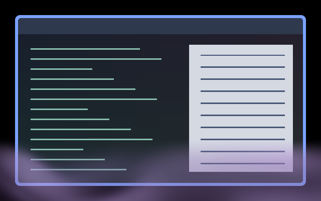

# Midnight Fog

Low, translucent purple mist drifts along the bottom of the output.

Preview: private headless Umbriel capture over synthetic light/dark content.
A still frame cannot demonstrate the motion or the complete pack together.

## Use

Save [effect.toml](effect.toml) and [shader.glsl](shader.glsl) in
`~/.config/umbriel/shaders/community/screen/midnight-fog/`. Merge [config.toml](config.toml)
into your main configuration, appending includes and merging existing tables.
Selects `after-dark.midnight-fog`. Including a preset only registers it.

## Configuration options

Edit the named constants at the top of `shader.glsl`. INTENSITY = 0.68 (0–1); FOG_HEIGHT = 0.32 of output height (0.15–0.45).

Colours use fixed purple hues, independent of the desktop theme.
Intensity zero removes the fog. Save edits to reload.

## Compatibility and cost

Requires Umbriel's preset-effects API. One source sample and three noise evaluations inside the fog band. Pixels above the band return unchanged. Preserves source alpha; no feedback. A continuous screen effect requests frames and prevents direct scanout on affected outputs.
See the [validation record](../../VALIDATION.md#halloween-presets-2026-10-09) for tested
versions and remaining limitations. Hardware performance is not benchmarked.

## Attribution

Original shader by Barrulus with Codex assistance, inspired by Umbriel's playful
Halloween icon. No raster assets are required.
License: [Barrulus MIT](../../LICENSES/Barrulus-MIT.txt).
