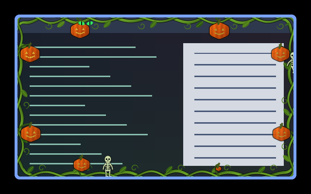

# Window effects

[Installation and configuration](../README.md#install)

| Preview | Effect | Description |
| --- | --- | --- |
|  | [adaptive-text-v4](adaptive-text-v4/) | An experimental content-adaptive contrast treatment. |
|  | [autumn-leaves](autumn-leaves/) | Animated autumn leaves over window content. |
|  | [beach-surf-overlay](beach-surf-overlay/) | The inner-window half of the beach-surf border effect; keeps inward decoration visible. |
|  | [cartoon-chase-overlay](cartoon-chase-overlay/) | The inner-window half of the cartoon-chase border effect; keeps inward decoration visible. |
|  | [crt](crt/) | A CRT-style treatment of the window image. |
|  | [faerie-magic-overlay](faerie-magic-overlay/) | The inner-window half of the faerie-magic border effect; keeps inward decoration visible. |
|  | [fire-tendrils](fire-tendrils/) | Moving fire tendrils over the window. |
|  | [flap-board](flap-board/) | Rectangular flaps turn in travelling waves, revealing inverted live content. |
|  | [flowering-vine-overlay](flowering-vine-overlay/) | The inner-window half of the flowering-vine border effect; keeps inward decoration visible. |
|  | [kzzzt](kzzzt/) | Hard-edged circuit traces creep in from the window edges and carry current, with colour-split glitches, scanlines, and a slow roll; reacts to sound when an audio level is fed to Umbriel. |
|  | [liquid-glass](liquid-glass/) | Diffused content with a refractive bevel and soft reflection. |
|  | [mercury-sheen](mercury-sheen/) | Flowing liquid-metal highlights give the content a chrome sheen. |
|  | [neon-bleed-overlay](neon-bleed-overlay/) | The inner-window half of the neon-bleed border effect; keeps inward decoration visible. |
|  | [paper-content](paper-content/) | Neutral white crumpled stationery, with static fibres and folds behind the content. |
|  | [paper-overlay](paper-overlay/) | The inner-window half of the paper border effect; keeps inward decoration visible. |
|  | [parchment](parchment/) | A parchment treatment of window content. |
|  | [parchment-dark](parchment-dark/) | A dark parchment treatment of window content. |
|  | [pink-purple-clouds](pink-purple-clouds/) | Slow curling pink and purple billows over window content. |
|  | [pink-ribbon-overlay](pink-ribbon-overlay/) | The inner-window half of the pink-ribbon border effect; keeps inward decoration visible. |
|  | [portal-lava-overlay](portal-lava-overlay/) | The inner-window half of the portal-lava border effect; keeps inward decoration visible. |
|  | [prairie-wind](prairie-wind/) | An animated prairie-wind treatment of the window image. |
|  | [rainbow-overlay](rainbow-overlay/) | The inner-window half of the rainbow border effect; keeps inward decoration visible. |
|  | [rainbow-radial](rainbow-radial/) | A radial rainbow treatment of the window image. |
|  | [rainbow-smoke](rainbow-smoke/) | Flowing rainbow smoke over window content. |
|  | [rainbow-waves](rainbow-waves/) | Animated rainbow waves over window content. |
|  | [rainfall](rainfall/) | Rain falling over the window image. |
|  | [rgb-border](rgb-border/) | An RGB-coloured edge treatment inside the window content. |
|  | [rgb-shimmer](rgb-shimmer/) | A shifting RGB shimmer across the window. |
|  | [ripple-drops](ripple-drops/) | Animated drop ripples distort the window image. |
|  | [rolling-clouds](rolling-clouds/) | Rolling clouds over window content. |
|  | [rorschach2](rorschach2/) | An animated inkblot-like treatment of the window image. |
|  | [scanlines](scanlines/) | Subtle horizontal scanlines over window content. |
|  | [sentient-circuit](sentient-circuit/) | Etched circuit buses, independent junctions, and light-reactive pulses. |
|  | [sentient-circuit-v2](sentient-circuit-v2/) | Growing, pulsing, and decaying circuit colonies in copper and pollen tones. |
|  | [snowfall](snowfall/) | Snow falling over window content. |
|  | [somethings-watching-overlay](somethings-watching-overlay/) | Inward vines, growing pumpkins, cat eyes and skeletons, selected by the After Dark border. |
