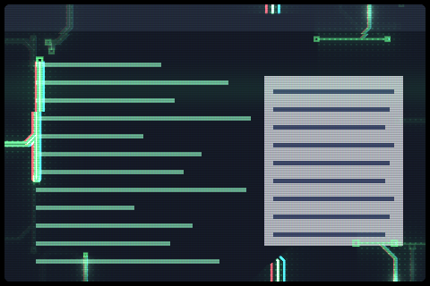

# kzzzt

Hard-edged circuit traces creep in from the window edges and carry current, with colour-split glitches, scanlines, and a slow roll over the picture. It reacts to sound when something feeds Umbriel an audio level and has a steady idle look when nothing does.



Frame rendered by Umbriel running this shader over a synthetic window sample, in the shader's own colours with no audio feed, so it shows the idle look; it is not a screenshot of a desktop session.

## Use

Download [effect.toml](effect.toml) and [shader.glsl](shader.glsl) using GitHub’s **Download raw file** button and save them together in `~/.config/umbriel/shaders/community/window/kzzzt/`. Keep the license notice linked below with your files. See [installation](../../README.md#install) for details.

Then merge this into `~/.config/umbriel/config.toml`:

```toml
[include]
files = ["shaders/community/window/kzzzt/effect.toml"]

[effects]
window = "kzzzt"
```

Append the include path to your existing `files` array and merge selectors into existing tables. Including `effect.toml` defines the preset; the selector enables it. [`config.toml`](config.toml) contains the same copyable example.

[kzzzt Ring](../../border/kzzzt-ring/) is the matching border. Install both and select both (`window = "kzzzt"` and `border = "kzzzt-ring"`) and they glitch on the same beat. If you edit the glitch values (`STEP`, `SPLIT_PX`, the `TEAR_*` and `FLINCH_*` constants) in one, make the same edit in the other.

## Audio

Audio is optional. Umbriel can hand effects one level from 0 to 1 that a program of your choice sends it; see [Audio input](https://github.com/noctalia-dev/umbriel/blob/main/docs/user/ipc.md#audio-input) for how a program does that. This collection does not include such a program.

- With nothing feeding Umbriel, or a program that is running while nothing plays, kzzzt shows its idle look: a steady set of traces. Silence below a level of about 0.02 counts as nothing playing.
- With a program feeding it sound, the traces follow the level. They brighten and grow more numerous as it rises, and treble widens the colour split.

## Theme palette

This preset enables `palette = true` in `effect.toml`. Artwork colours follow
Umbriel's `[colors]` accents, warning, and error colours, while retaining shading
and highlights. Set `palette = false` in that preset to restore the original
colours (green traces with cyan and red colour splits). Shader colour constants are the fallback colours.

## Configuration options

Edit the existing `[effects.preset.kzzzt]` table in [effect.toml](effect.toml).
The [complete configuration reference](../../README.md#configuration-reference) explains
selection, overrides, and accepted ranges. The values below are this preset's shipped
settings, including defaults for omitted keys.

| TOML setting | Shipped value | What changing it does |
| --- | --- | --- |
| `kind` | `"window"` | Keep this kind: the source implements its `window` entry point. |
| `shader` | `"shader.glsl"` | Loads the source beside this preset; change the path only when using another compatible source. |
| `palette` | `true` | Supplies theme colours. Disable it to use the shader's fallback colours. |

There is no TOML `speed`, `animated`, or `opacity` setting for this kind.
Motion and strength changes are GLSL edits below.
Global `[effects] max_fps` limits effect-driven frames, and `in_capture`
controls inclusion in screencopy/image-copy captures. Neither resizes the artwork.

### Shader controls

Edit these values in [shader.glsl](shader.glsl), not in TOML. `#define` is
active GLSL code; comments use `//` or `/* ... */`. Start with small changes
and keep paired shaders in sync. Keep size and duration divisors positive.
The shipped values are what the author uses; other values were not range-tested.

| GLSL control or expression | Shipped value | Visual effect |
| --- | --- | --- |
| `TRACE_CHANCE`, `IDLE_TRACE_CHANCE` | `0.9`, `0.6` | Share of wiring slots along the edges that hold a trace, with and without an audio feed. Lower gives fewer traces. |
| `ACTIVE_TRACES`, `IDLE_ACTIVE_TRACES` | `40.0`, `16.0` | Average number of traces alive at once, with and without an audio feed. An average, not a cap. |
| `SILENCE_LOW`, `SILENCE_HIGH` | `0.02`, `0.10` | Audio levels below the first count as silence and show the idle look; from the second up the effect is fully reactive, with a smooth blend between. |
| `TRACE_STRENGTH` | `0.9` | Brightness of the traces. |
| `LIFE` | `2.6` | Seconds a trace lives. |
| `FLINCH_PERIOD`, `FLINCH_CHANCE` | `15.0`, `0.8` | Seconds between chances for a window to flinch, and the odds that a chance flinches. Each window has its own offset. |
| `TEAR_PX` | `6.0` | Largest sideways shift, in logical pixels, of a torn band during a flinch. |
| `SCANLINE_DEPTH` | `0.18` | How much alternate pixel rows darken. `0` removes the scanlines. |
| `GRILLE_DEPTH` | `0.12` | Strength of the red, green, blue column mask. `0` removes it. |
| `ROLL_STRENGTH`, `ROLL_PERIOD` | `0.06`, `7.0` | Brightness of the slow band that sweeps down the window, and seconds per sweep. `ROLL_STRENGTH = 0` removes it. |
| `FLICKER` | `0.03` | Brightness flicker of the whole window. `0` removes it. |

Save and reload; see [reloading edits](../../README.md#reloading-edits).

## Compatibility and cost

Requires an Umbriel build that includes [`105e1bc8`](https://github.com/noctalia-dev/umbriel/commit/105e1bc8), which added the audio level the shader reads; older builds were not tested. See [validation and limitations](../../VALIDATION.md). No previous-frame feedback buffers are used. The shader reads `umbriel_time`, so it keeps requesting frames while a window is visible. It takes one sample per fragment, three while a window flinches, and runs bounded loops near the window edges. This adds a pass per affected window; applying it globally increases the cost with the number and size of visible windows. No performance benchmark is claimed.

## Attribution

Author/contributor: weegs710. License: [MIT](../../LICENSES/weegs710-MIT.txt).

The point-to-segment distance helper (`sh_segment`) is from Barrulus's [Sentient Circuit v2](../sentient-circuit-v2/), MIT, see [LICENSES/Barrulus-MIT.txt](../../LICENSES/Barrulus-MIT.txt).
